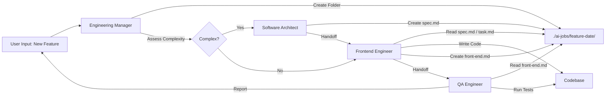

```mermaid
graph LR;
User[User Input: New Feature] --> Manager[Engineering Manager]
Manager -->|Create Folder| FileSys[./ai-jobs/feature-date/]
Manager -->|Assess Complexity| Decision{Complex?}

    Decision -- Yes --> Arch[Software Architect]
    Decision -- No --> FE[Frontend Engineer]

    Arch -->|Create spec.md| FileSys
    Arch -->|Handoff| FE

    FE -->|Read spec.md / task.md| FileSys
    FE -->|Write Code| Codebase
    FE -->|Create front-end.md| FileSys
    FE -->|Handoff| QA[QA Engineer]

    QA -->|Read front-end.md| FileSys
    QA -->|Run Tests| Codebase
    QA -->|Report| User
```
