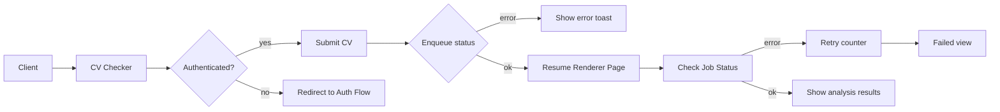

# 🔎 AI Resume analyzer

A Next.js web application for CV analysis and enhancement. Users can upload or paste their resumes and vacancy descriptions, select analysis modes, and receive detailed reports featuring error lists, metrics, and export options (DOCX/HTML).

- The platform includes multi-language support (next-intl), theme customization, and data persistence and auth flows via Supabase.
- The application core functionality relies on integration with the [z1mak-cv-queue](https://www.google.com/search?q=https://github.com/DmitriyMuliak/z1mak-cv-queue) backend service for asynchronous analysis and task management.

## ✨ Key Features

- **Parsing & Normalization:** Supports PDF/DOCX/Images with OCR integration (tesseract.js).
- **AI Analysis:** Multiple modes (General/Job-specific, IT/Common) with varying depth; async results via API queue.
- **Results Dashboard:** Metrics, error tracking, "red flags," and actionable recommendations.
- **User History:** Persistent storage via Supabase with a modal-based history viewer.
- **Modern UI:** Tailwind CSS v4, dark/light modes, animations, and a theme configurator.

## 🧩 Architecture Diagram



## 🛠 Tech Stack

- **Frontend:** Next.js 16 (App Router, Turbopack), React 19, next-intl, next-themes, Tailwind CSS v4.
- **State & Forms:** Zustand, react-hook-form, valibot.
- **File Processing:** pdfjs-dist, docx, tesseract.js, dropzone.
- **Backend/API:** Supabase SSR (Auth/DB), Server Actions for analysis API.
- **Testing:** Vitest + @testing-library/react.

## 🧠 Integration

Integration with the [z1mak-cv-queue](https://www.google.com/search?q=https://github.com/DmitriyMuliak/z1mak-cv-queue) backend service for asynchronous task processing and analysis queue management.

## 🚀 Quick Start

```bash
npm install
npm run dev           # Turbopack dev
# or
npm run dev-webpack   # Webpack dev fallback

```

URL: `http://localhost:3000`

## 🎛️ Production

```bash
npm run build         # Turbopack build
npm run start
# or
npm run build-webpack # Webpack build fallback

```

## 🚦 Testing

```bash
npm test
npm run test:run      # CI/Single run

```

## 📁 Contribution & Folder structure

- **Localization:** Add translation keys in `messages/` and configure routes in `src/i18n`.
- **Core Logic:** Feature components are located in `src/features/cv-checker/`, page routes in `src/app/[locale]/cv-checker`.

```
root
├── src
│   ├── actions        // server actions (CV analysis, statuses, history)
│   ├── api            // API clients and routers
│   ├── app            // Next.js App Router pages, layouts, locale routes
│   ├── components     // shared UI components (header, loaders, toggles)
│   ├── consts         // constants and configs
│   ├── content        // static content/markdown
│   ├── docs           // internal docs
│   ├── features       // isolated features, main one is cv-checker
│   ├── hooks          // custom React hooks
│   ├── i18n           // localization and routes (next-intl)
│   ├── lib            // utilities and clients (supabase, helpers)
│   ├── schema         // validation schemas and data types
│   ├── store          // Stores and common utilities
│   ├── test           // testing utilities
│   ├── types          // shared TypeScript types
│   ├── utils          // small utility functions
│   ├── proxy.ts.      // entry point for requests, handle auth
│   ├── next-intl.d.ts
│   └── globals.d.ts
├── supabase
│   ├── Migrations.md
│   ├── config.toml
│   ├── migrations
│   └── templates
├── messages
│   ├── en.json
│   └── uk.json
├── public
│   └── docxWorker.js
├── README.md
├── package.json
├── components.json
├── eslint.config.mjs
├── next-env.d.ts
├── next.config.ts
├── postcss.config.mjs
├── tsconfig.json
├── tsconfig.tsbuildinfo
├── vercel.json
└── vitest.config.ts
```
