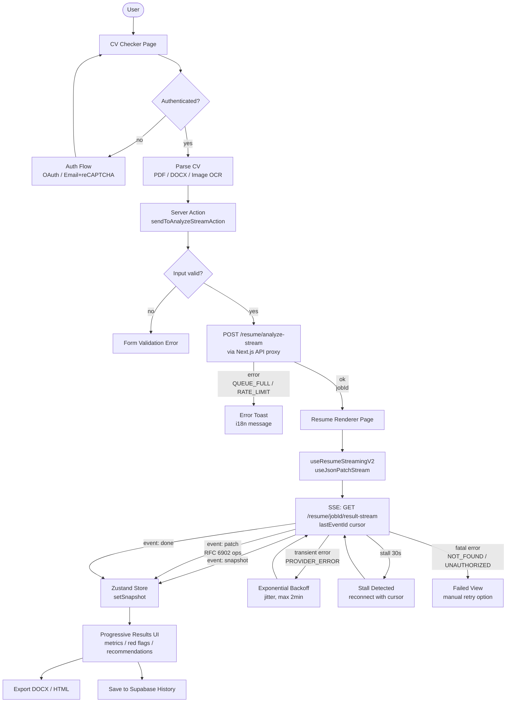

# 🧠 AI Resume Analyzer

A production-grade Next.js application for intelligent CV analysis and enhancement. Users upload or paste their resumes and job descriptions, select analysis modes, and receive structured reports with error diagnostics, scoring metrics, and export options (DOCX/HTML).

- Multi-language support (next-intl), theme customization, and data persistence with Supabase auth flows.
- Core analysis pipeline integrates with the [z1mak-cv-queue](https://github.com/DmitriyMuliak/z1mak-cv-queue) backend service via a real-time **RFC 6902 JSON Patch streaming** protocol.

# ⚙️ Key Features

- **Parsing & Normalization:** PDF/DOCX/Image ingestion with OCR (tesseract.js) and dynamic parser imports.
- **AI Analysis:** Multiple modes (General/Job-specific, IT/Common) with varying depth; results streamed in real-time via SSE.
- **Streaming Results Dashboard:** Metrics, error tracking, "red flags," and actionable recommendations rendered progressively as patches arrive.
- **Resilient Streaming:** Automatic reconnection with exponential backoff, stall detection (30s timeout), and cursor-based mid-stream resume.
- **User History:** Persistent storage via Supabase with a modal-based history viewer.
- **Modern UI:** Tailwind CSS v4, dark/light modes, animations, and a theme configurator.

# 🧩 1. Architecture Diagram


```mermaid
flowchart TD
    User([User]) --> Checker[CV Checker Page]

    Checker --> Auth{Authenticated?}
    Auth -- no --> AuthFlow[Auth Flow\nOAuth / Email+reCAPTCHA]
    AuthFlow --> Checker

    Auth -- yes --> Parse[Parse CV\nPDF / DOCX / Image OCR]
    Parse --> ServerAction[Server Action\nsendToAnalyzeStreamAction]
    ServerAction --> Validate{Input valid?}
    Validate -- no --> FormError[Form Validation Error]
    Validate -- yes --> Enqueue[POST /resume/analyze-stream\nvia Next.js API proxy]

    Enqueue -- error\nQUEUE_FULL / RATE_LIMIT --> Toast[Error Toast\ni18n message]
    Enqueue -- ok\njobId --> StreamPage[Resume Renderer Page]

    StreamPage --> StreamHook[useResumeStreamingV2\nuseJsonPatchStream]

    StreamHook --> SSE[SSE: GET /resume/jobId/result-stream\nlastEventId cursor]

    SSE -- event: snapshot --> Zustand[Zustand Store\nsetSnapshot]
    SSE -- event: patch\nRFC 6902 ops --> Zustand
    SSE -- event: done --> Zustand

    Zustand --> Results[Progressive Results UI\nmetrics / red flags / recommendations]

    SSE -- transient error\nPROVIDER_ERROR --> Backoff[Exponential Backoff\njitter, max 2min]
    Backoff --> SSE

    SSE -- stall 30s --> Reconnect[Stall Detected\nreconnect with cursor]
    Reconnect --> SSE

    SSE -- fatal error\nNOT_FOUND / UNAUTHORIZED --> FailedView[Failed View\nmanual retry option]

    Results --> Export[Export DOCX / HTML]
    Results --> History[Save to Supabase History]
```

# 💫 2. Streaming API

The result delivery is powered by a layered SSE streaming architecture with progressive JSON rendering via RFC 6902 patches.

## 🔌 Protocol

The server emits a sequence of typed SSE events:

| Event      | Payload                  | Description                                        |
| ---------- | ------------------------ | -------------------------------------------------- |
| `snapshot` | `{ data, status }`       | Full initial state when connecting or reconnecting |
| `patch`    | `{ ops: JSONPatchOp[] }` | Incremental RFC 6902 operations                    |
| `done`     | `{ status, usedModel }`  | Stream complete, includes model metadata           |
| `error`    | `{ code, message }`      | Terminal or retryable error                        |

**Example patch event:**

```
id: 42
event: patch
data: {"ops":[{"op":"add","path":"/overallAnalysis","value":{...}}]}
```

## Cursor-based Reconnection

Each SSE event carries a monotonic `id`. On disconnect, the client includes `lastEventId` in the next request body, and the server resumes from that offset — avoiding redundant reprocessing of already-delivered sections.

```
POST /api/resume/[jobId]/result-stream
{ "lastEventId": "42" }
```

The cursor is persisted in `sessionStorage` so it survives React re-renders and StrictMode double-mounts.

## Resilience Strategy

- **Stall detection:** 30-second inactivity timeout triggers reconnect.
- **Exponential backoff with jitter:** Base delay doubles on each attempt, capped at 2 minutes.
- **Fatal vs. retryable errors:** `NOT_FOUND`, `UNAUTHORIZED` stop reconnection; `PROVIDER_ERROR` retries automatically.
- **Manual retry:** Clears the session cursor and restarts the stream from scratch.

## Hook Architecture

```text
useJsonPatchStream          ← generic SSE + JSON Patch infra (reusable)
  └── useResumeStreamingV2  ← domain adapter (wires Zustand store)
        └── analysisStore   ← Zustand store with Immer + applyPatches
```

`useJsonPatchStream` is fully generic — it handles the SSE lifecycle, reconnection, backoff, stall detection, and telemetry. `useResumeStreamingV2` is a thin adapter that maps stream events to Zustand actions and provides microtask batching: multiple patches arriving in the same TCP chunk collapse into a single store update and a single React render.

## Telemetry

The streaming hook emits structured telemetry events for observability:

```typescript
type TelemetryEvent =
  | { type: 'connect' }
  | { type: 'reconnect'; attemptNumber: number }
  | { type: 'snapshot_received'; durationMs: number }
  | { type: 'patch_received'; patchCount: number }
  | { type: 'stall_detected' }
  | { type: 'done'; durationMs: number }
  | { type: 'error'; code: string }
  | { type: 'aborted' };
```

## API Proxy Routes

| Route                               | Method | Description                                                       |
| ----------------------------------- | ------ | ----------------------------------------------------------------- |
| `/api/resume/analyze-stream`        | POST   | Proxies analysis request to backend, forwards `ReadableStream`    |
| `/api/resume/[jobId]/result-stream` | POST   | SSE proxy with `X-Accel-Buffering: no` to prevent proxy buffering |

# 🏗️ 3. Tech Stack

- **Frontend:** Next.js 15 (App Router, Turbopack), React 19, React-Query, next-intl, next-themes, Tailwind CSS v4.
- **Streaming:** `@microsoft/fetch-event-source`, `fast-json-patch` (RFC 6902).
- **State & Forms:** Zustand (`subscribeWithSelector` + Immer), react-hook-form, valibot.
- **File Processing:** pdfjs-dist, docx, tesseract.js, dropzone (dynamic imports).
- **Backend/API:** Supabase SSR (Auth/DB), typed Server Actions, custom `ApiService` with interceptor middleware.
- **Testing:** Vitest + @testing-library/react.

# 🚧 4. Error Handling

Three-tier strategy ensuring errors are caught at the appropriate layer:

1. **API Service:** `ApiError` with status, body (capped at 16 KB to prevent OOM), and request config.
2. **Server Action wrapper:** `createAsyncServerAction` normalizes all outcomes to `{ success, data } | { success: false, error }`.
3. **Component layer:** React `ErrorBoundary` for unhandled exceptions; `sonner` toasts for user-facing errors with i18n messages.

Rate-limit error codes are specific enough to display targeted UI feedback: `QUEUE_FULL`, `CONCURRENCY_LIMIT`, `USER_RPD_LIMIT:lite`, `USER_RPD_LIMIT:hard`, `MODEL_LIMIT`.

# 🛡️ 5. Auth Flow

- **OAuth (Google):** Supabase identity linking with automatic user creation.
- **Email/Password:** `createFormAction` wrapper with valibot schema validation and reCAPTCHA.
- **Server-side auth injection:** Request interceptor on the server API client auto-attaches `Authorization: Bearer` and `x-internal-api-key` headers; redirects to login if session is absent.

## Environment Validation

Strict runtime validation for environment variables via Valibot — the app throws a `Configuration Error` on startup if any required key is missing. All env variables are typed and accessed via `privatePrEnv` / `publicPrEnv`.

# 🏎️ 6. Quick Start

```bash
npm install
npm run dev           # Turbopack dev server
# or
npm run dev-webpack   # Webpack fallback
```

`http://localhost:3000`

## Production

```bash
npm run build         # Turbopack build
npm run start
# or
npm run build-webpack # Webpack fallback
```

# 🔍 7. Testing

```bash
npm run test
npm run test:run      # CI / single run
```

---

# 📁 8. Folder structure

- **Localization:** Add translation keys in `messages/` and configure routes in `src/i18n`.
- **Core Logic:** Feature components in `src/features/cv-checker/`, page routes in `src/app/[locale]/cv-checker`.

```text
root
├── src
│   ├── actions        // server actions (CV analysis, statuses, history)
│   ├── api            // ApiService, interceptors, client/server instances
│   ├── app            // Next.js App Router pages, layouts, locale routes, API proxy routes
│   ├── components     // shared UI components (header, loaders, toggles)
│   ├── consts         // constants and configs
│   ├── content        // static content/markdown
│   ├── docs           // internal docs
│   ├── features       // isolated features, main one is cv-checker
│   ├── hooks          // custom React hooks (useJsonPatchStream, useFetchEventSourceStream)
│   ├── i18n           // localization and routes (next-intl)
│   ├── lib            // utilities and clients (supabase, helpers)
│   ├── schema         // valibot validation schemas and data types
│   ├── store          // Zustand stores and common utilities
│   ├── types          // shared TypeScript types
│   ├── utils          // small utility functions
│   ├── proxy.ts       // entry point for requests, handles auth
│   ├── next-intl.d.ts
│   └── globals.d.ts
├── tests              // unit & integration tests and utilities
├── supabase
│   ├── config.toml
│   └── templates
├── messages
│   ├── en.json
│   └── uk.json
├── public             // static assets
├── .husky             // Git hooks
├── .gemini            // Gemini config
├── README.md
├── package.json
├── components.json
├── eslint.config.mjs
├── next-env.d.ts
├── next.config.ts
├── postcss.config.mjs
├── tsconfig.json
├── vercel.json
└── vitest.config.ts
```
